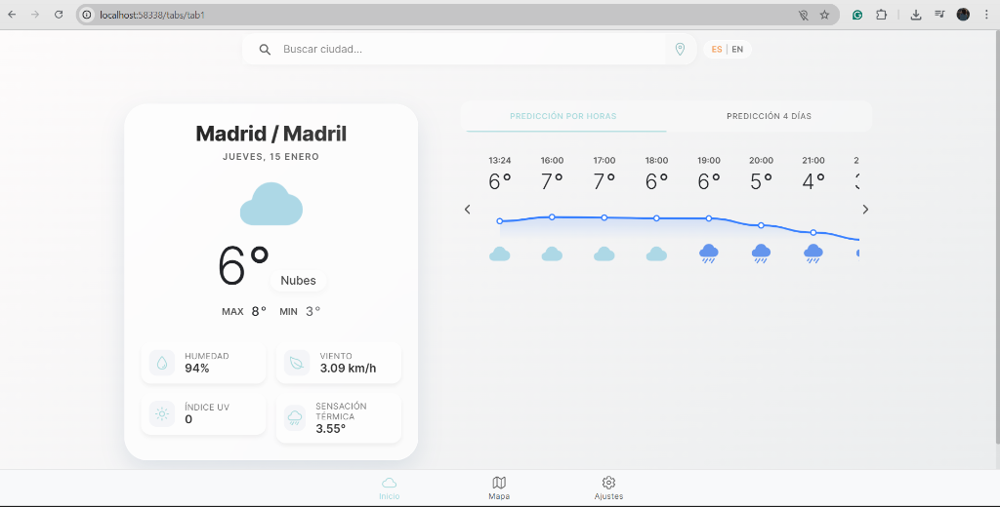
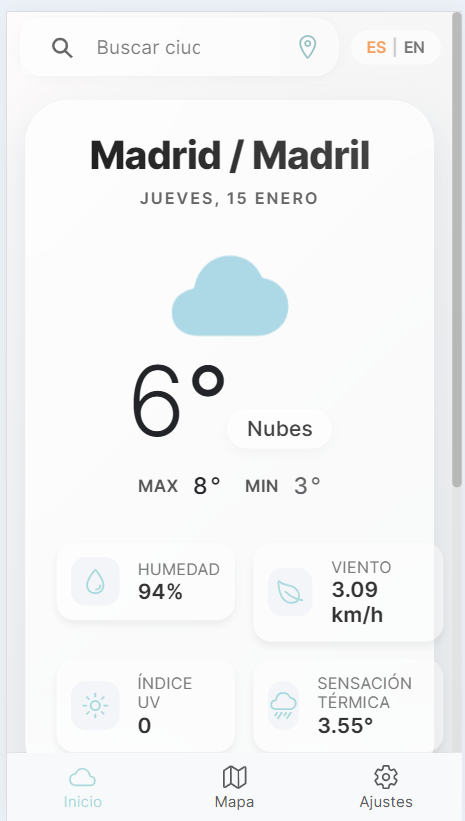
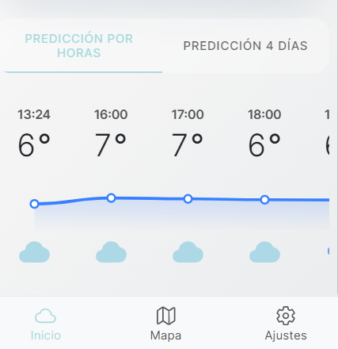
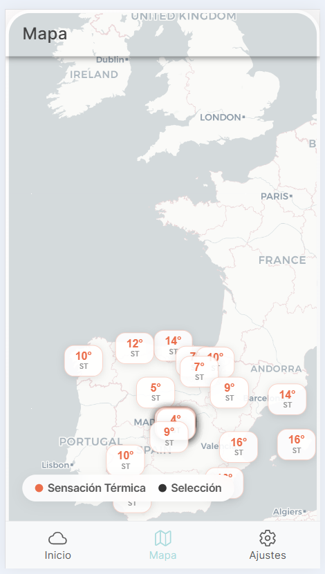
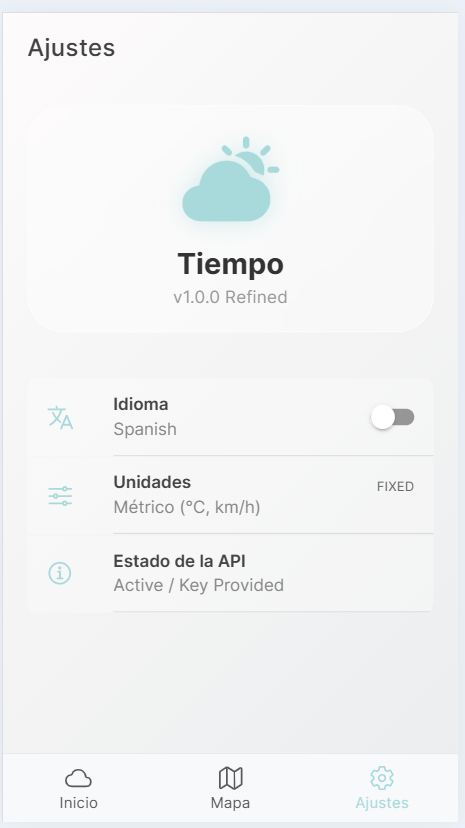

# Weather is Sweet (El Tiempo es Dulce)

Una **aplicación meteorológica** minimalista y elegante construida con **Ionic**, **Angular** y la **API de OpenWeather**.

## Funcionalidades
- **Diseño Atómico**: Organizado en **Átomos**, **Moléculas**, **Organismos** y **Plantillas**.
- **Arquitectura SOLID**: Código refactorizado siguiendo el **Principio de Responsabilidad Única (SRP)**.
- **Interfaz Moderna**: Diseño limpio con tonos **pastel**, transiciones suaves y efectos de **glassmorphism**.
- **Búsqueda y Geolocalización**: Búsqueda por **nombre de ciudad** o mediante la **ubicación actual** del dispositivo.
- **Mapa Interactivo**: Visualización dinámica de las condiciones climáticas en un **mapa**.
- **Multi-idioma**: Localización completa en **Inglés** y **Castellano**.
- **Adaptable**: Optimizado para funcionamiento en **Android** y **Web**.
- **Datos Detallados**:
    - Información actual (**Temperatura**, **Viento**, **Índice UV**, **Humedad**, etc.).
    - Predicción por horas para las próximas **24 horas** (con gráfico visual).
    - Predicción diaria para **5 días** (incluyendo el actual).

## Stack Técnico
- **Framework**: **Ionic Framework** (Componentes Standalone)
- **Núcleo**: **Angular** con principios **SOLID**
- **API**: **OpenWeather** (One Call 3.0, Geocoding)
- **i18n**: **ngx-translate**
- **Iconos**: **Ionicons**

### Arquitectura (SOLID)
La aplicación sigue una **separación estricta** de responsabilidades:
- **WeatherApiService**: Gestiona exclusivamente la comunicación **HTTP** con **OpenWeatherMap**.
- **WeatherTransformationService**: Servicio de **lógica pura** para transformar el **JSON** crudo en los modelos de la aplicación (**WeatherData**).
- **WeatherService**: Fachada para la **gestión de estado** y orquestación entre servicios.
- **GeolocationService**: Gestiona **permisos** y **coordenadas** del dispositivo.

## Configuración para Desarrolladores
1. **Clonar** el repositorio:
   git clone [url-del-repo]
   cd Weather
2. **Instalar** dependencias:
   npm install
3. **Configurar** la Clave de API:
   Abrir **src/environments/environment.ts** y reemplazar 'YOUR_API_KEY_HERE' con su clave de **OpenWeather API**.
   **Importante**: Asegúrese de que su clave tenga acceso al endpoint **One Call 3.0**.
4. **Ejecutar** la aplicación:
   ionic serve

## Sistema de Diseño (Atomic Design)
- **Átomos**: weather-icon, temp-display
- **Moléculas**: search-bar, weather-detail
- **Organismos**: current-weather-card, forecast-list, weather-map
- **Plantillas**: weather-page-template

## Capturas de Pantalla
### Vista General

### Detalles y Predicción

### Mapa y Ajustes

