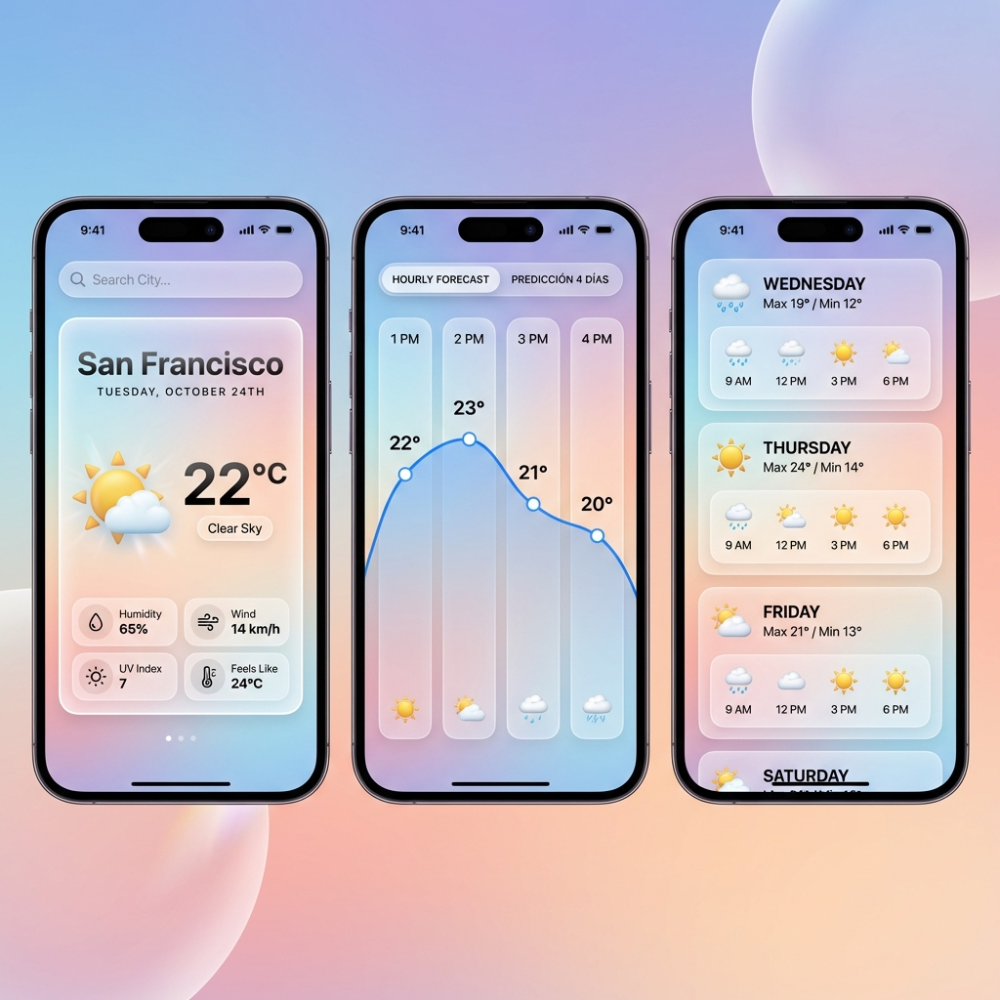

# Weather is Sweet (El Tiempo es Dulce)

Una **aplicación meteorológica** minimalista y elegante construida con **Ionic**, **Angular** y la **API de OpenWeather**.

## Funcionalidades
- **Diseño Atómico**: Estructura organizada en **Átomos**, **Moléculas**, **Organismos** y **Plantillas** para una máxima modularidad.
- **Arquitectura SOLID**: Código refactorizado siguiendo estrictamente el **Principio de Responsabilidad Única (SRP)**.
- **Interfaz Moderna**: Estética limpia con tonos **pastel**, transiciones fluidas y efectos de **glassmorphism**.
- **Búsqueda y Geolocalización**: Permite buscar por **nombre de ciudad** o detectar la **ubicación actual** del usuario.
- **Mapa Interactivo**: Visualización de las condiciones meteorológicas mediante un **mapa dinámico**.
- **Sistema Multi-idioma**: Soporte completo y conmutación en tiempo real entre **Inglés** y **Castellano**.
- **Diseño Adaptable**: Interfaz optimizada para una experiencia nativa tanto en **Android** como en entornos **Web**.
- **Datos Completos**:
    - Información meteorológica en tiempo real (**Temperatura**, **Viento**, **Índice UV**, **Humedad**, etc.).
    - Predicción detallada por horas para las próximas **24 horas** con representación gráfica.
    - Predicción diaria extendida para **5 días**.

## Stack Técnico
- **Framework**: **Ionic Framework** utilizando **Componentes Standalone**.
- **Núcleo de Lógica**: **Angular** implementado con principios **SOLID**.
- **Proveedor de Datos**: **OpenWeather** (APIs de One Call 3.0 y Geocoding).
- **Internacionalización**: **ngx-translate**.
- **Iconografía**: **Ionicons**.

### Arquitectura de Servicios (SOLID)
El sistema se ha dividido para cumplir con la **separación de responsabilidades**:
- **WeatherApiService**: Encargado exclusivamente de las peticiones **HTTP**.
- **WeatherTransformationService**: Servicio dedicado a la **transformación de datos** y lógica de negocio.
- **WeatherService**: Actúa como **fachada** para la gestión del **estado** y la coordinación.
- **GeolocationService**: Gestiona de forma aislada los **permisos** y la obtención de **coordenadas**.

## Configuración para Desarrolladores
1. **Clonación** del proyecto:
   git clone [url-del-repositorio]
   cd Weather
2. **Instalación** de dependencias:
   npm install
3. **Configuración de la API**:
   Localice el archivo **src/environments/environment.ts** y asigne su código personal a la variable de la **API de OpenWeather**.
   **Nota**: Asegúrese de que su suscripción incluya el endpoint **One Call 3.0**.
4. **Lanzamiento**:
   Para desarrollo local, ejecute: **ionic serve**.

## Sistema de Diseño (Atomic Design)
- **Átomos**: weather-icon, temp-display.
- **Moléculas**: search-bar, weather-detail.
- **Organismos**: current-weather-card, forecast-list, weather-map.
- **Plantillas**: weather-page-template.

## Galería de Diseño

El diseño previo y la previsualización de la herramienta están disponibles en la raíz del repositorio.
